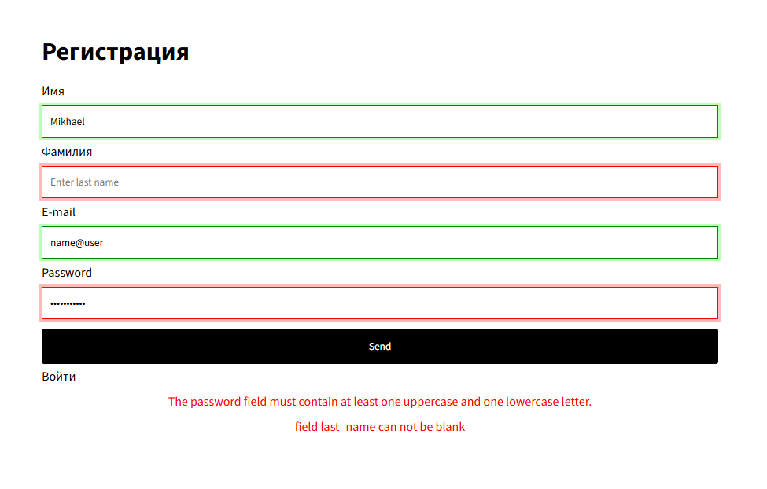
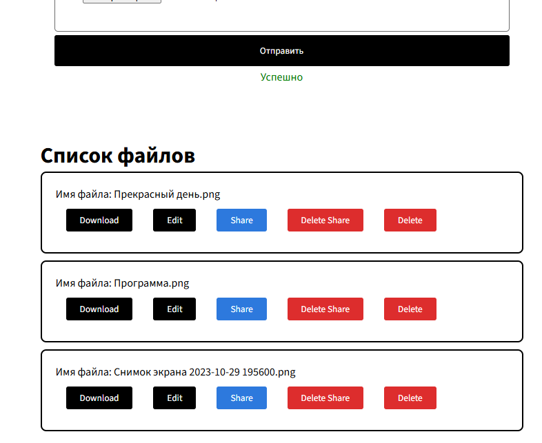
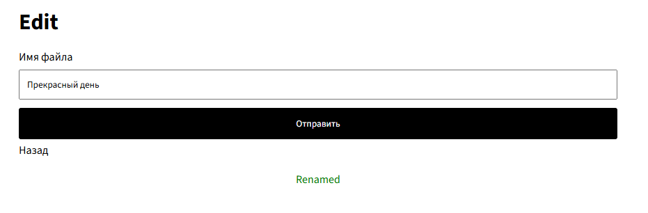
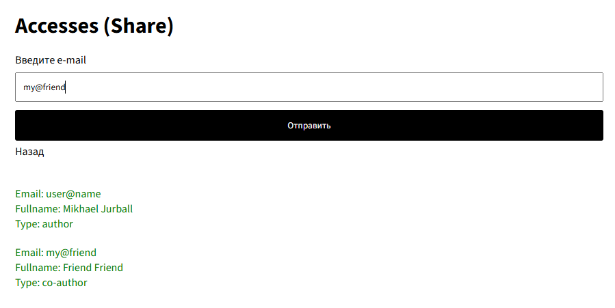

# NewLife на стороне клиента

**Описание:** Облачное хранилище с возможностью
разграничения прав доступа к файлам (1920x1080)

Сервер: https://github.com/jurball/NewLife-backend-L11

## Зависимости

- **Node.js v22.14.0**

## Установка

1. ```bash
   $ git clone https://github.com/jurball/newlife-frontend-react
   ```

2. ```bash
   $ npm install
   ```
   Запуск:
   ```bash
   $ npm start
   ```
   Сборка:
   ```bash
   $ npm run build
   ```

## Сломай приложение!


## Файлы на сервере


## Имя файла можно редактировать


## Поделиться с другом

